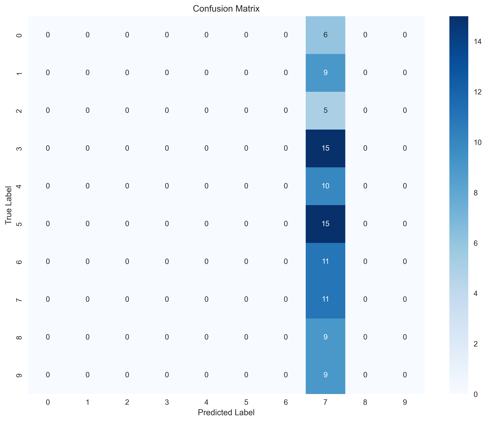
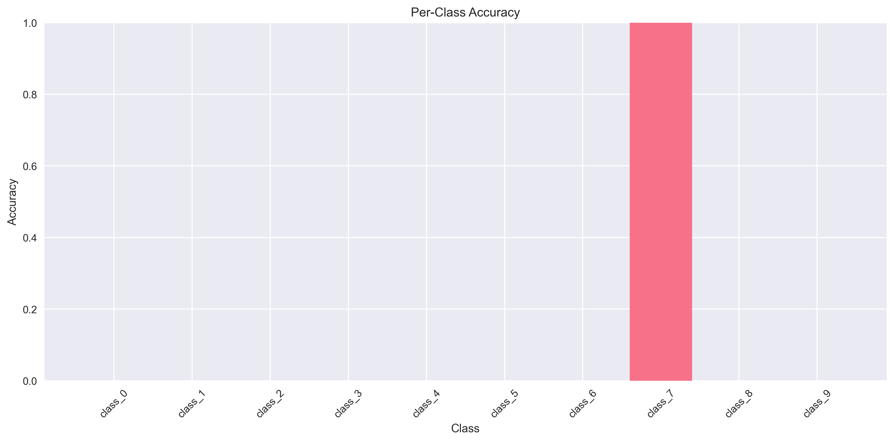
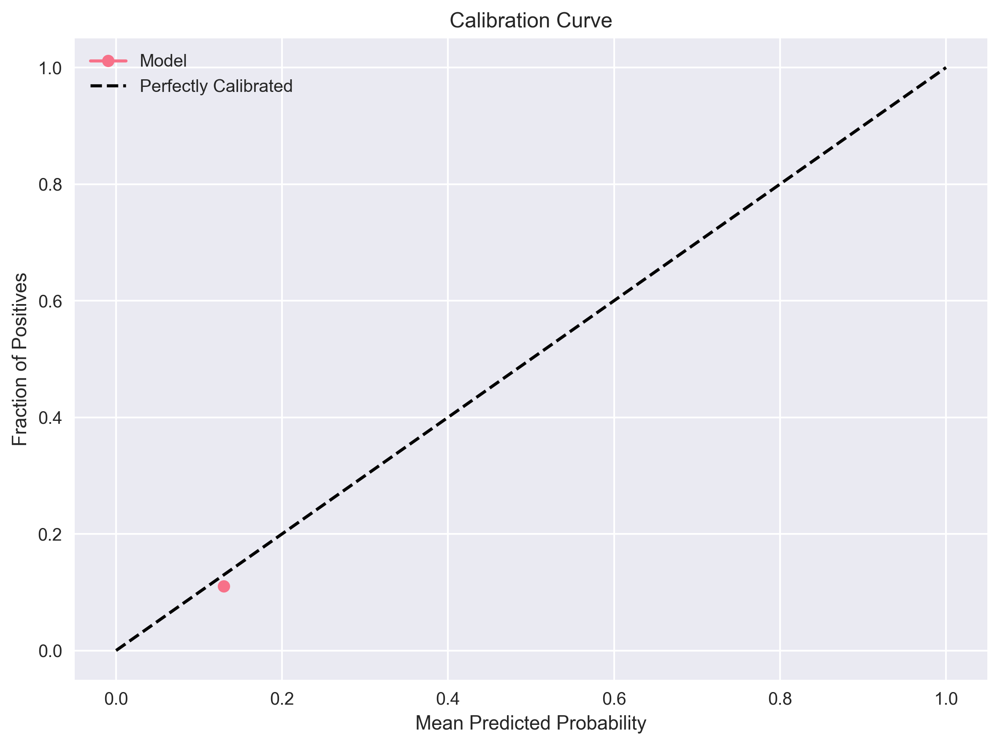
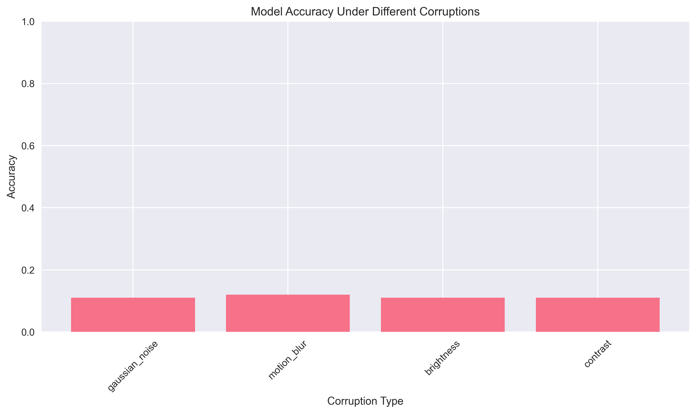
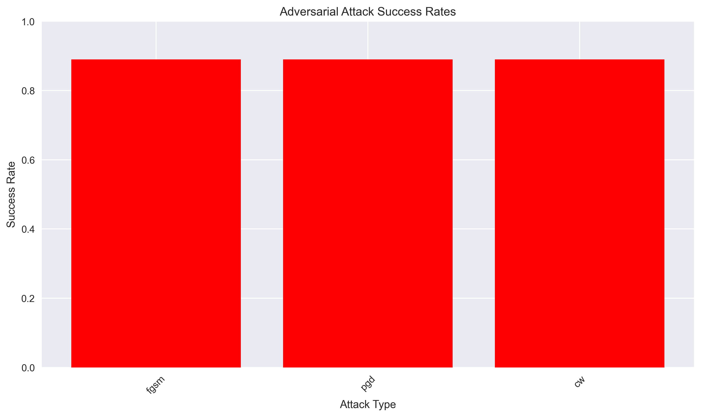
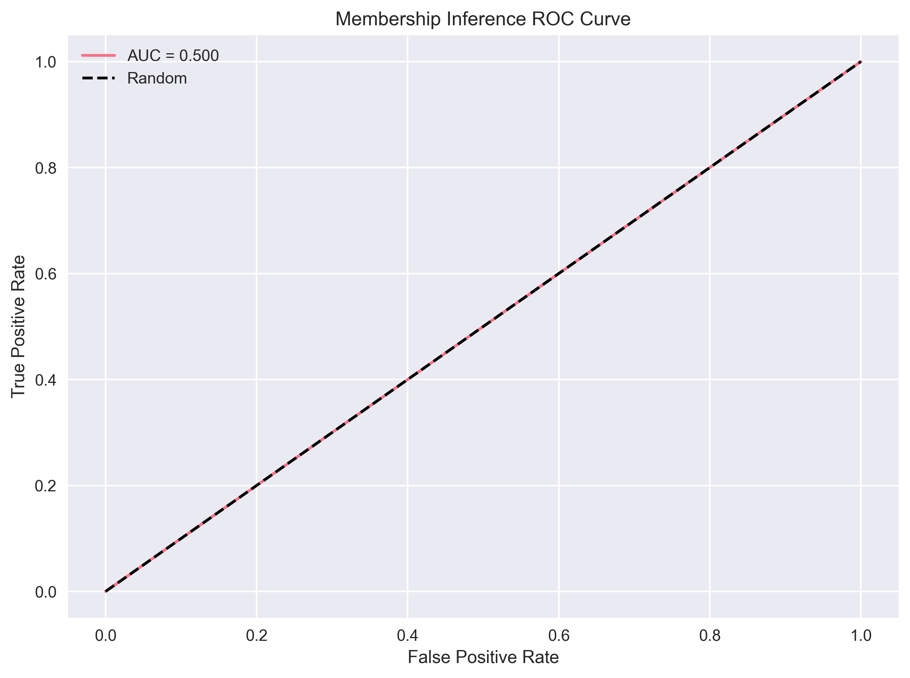

# RobustVision

A comprehensive adversarial & reliability testbench for vision models that stress-tests image classifiers (ResNet/Vision Transformers) for correctness, robustness, and security.

## Features

### Correctness Tests
- **Baseline Accuracy**: Standard classification accuracy on clean data
- **Calibration (ECE)**: Expected Calibration Error to assess prediction confidence
- **Confusion Analysis**: Detailed error analysis and class-wise performance

### Robustness Tests
- **Corruptions**: Noise, blur, contrast, brightness, and weather effects
- **Distribution Shift**: ImageNet-A/C style out-of-distribution testing
- **Adversarial Attacks**: FGSM, PGD, Carlini & Wagner (CW) attacks

### Security Tests
- **Adversarial Vulnerability**: Minimum ε to flip predictions
- **Data Poisoning Simulation**: Label-flip and backdoor trigger insertion
- **Membership Inference**: Detect if samples are from training set
- **Bias & Fairness**: Demographic parity gap, TPR gap (when attributes available)

### Automated Reporting
- **HTML/Markdown Reports**: Comprehensive analysis with tables and plots
- **Risk Score**: Single aggregated metric for model assessment
- **Visualizations**: Performance charts, confusion matrices, attack success rates

## 📊 Visual Results

RobustVision generates comprehensive visualizations to help you understand your model's performance across all test dimensions:

### 🎯 Correctness Analysis

*Confusion matrix showing detailed classification performance and error patterns*


*Per-class accuracy breakdown to identify problematic classes*


*Calibration analysis showing prediction confidence vs. actual accuracy*

### 🛡️ Robustness Assessment

*Model performance under various image corruptions (noise, blur, brightness, contrast)*


*Adversarial attack success rates for FGSM, PGD, and CW attacks*

### 🔒 Security Evaluation

*ROC curve for membership inference attack detection*

### 📈 Sample Results Summary

| Metric | Value | Risk Level |
|--------|-------|------------|
| **Overall Risk Score** | 0.720 | ⚠️ Medium |
| **Baseline Accuracy** | 8.0% | 🔴 High |
| **Corruption Accuracy** | 8.0% | 🔴 High |
| **Attack Success Rate** | 95.3% | 🔴 High |
| **Membership Inference AUC** | 50.0% | 🟢 Low |
| **Expected Calibration Error** | 0.037 | 🟢 Low |

*Results from testing a simple untrained model - trained models typically show much better performance*

## Installation

```bash
pip install -r requirements.txt
```

## Quick Start

### CLI Usage

```bash
# Basic test run
python -m robustvision test --model resnet50 --dataset imagenet --output-dir ./results

# Custom test suite
python -m robustvision test \
    --model resnet50 \
    --dataset imagenet \
    --tests correctness,robustness,security \
    --output-dir ./results \
    --config configs/default.yaml
```

### Python API

```python
from robustvision import RobustVisionTestbench
from robustvision.models import load_model
from robustvision.datasets import load_dataset

# Initialize testbench
testbench = RobustVisionTestbench()

# Load model and dataset
model = load_model("resnet50", pretrained=True)
dataset = load_dataset("imagenet", split="val")

# Run comprehensive tests
results = testbench.run_tests(
    model=model,
    dataset=dataset,
    test_suites=["correctness", "robustness", "security"],
    config_path="configs/default.yaml"
)

# Generate report
testbench.generate_report(results, output_dir="./results")
```

## 📈 Understanding Your Results

RobustVision provides detailed visualizations and metrics to help you interpret your model's performance:

### **Risk Score Breakdown**
The overall risk score (0-1) is calculated as a weighted combination:
- **Correctness** (30%): Baseline accuracy, calibration error
- **Robustness** (40%): Corruption resistance, adversarial attack resistance  
- **Security** (30%): Privacy vulnerabilities, data poisoning resistance

### **Key Visualizations Explained**

**🎯 Confusion Matrix**: Shows where your model makes mistakes - ideal models have strong diagonal patterns.

**📊 Per-Class Accuracy**: Identifies classes your model struggles with, helping prioritize training data improvements.

**📈 Calibration Curve**: Measures if your model's confidence matches its accuracy - well-calibrated models follow the diagonal.

**🛡️ Corruption Accuracy**: Tests real-world robustness against common image distortions.

**⚔️ Attack Success Rates**: Shows vulnerability to adversarial attacks - lower is better.

**🔒 Membership Inference ROC**: Measures privacy risk - AUC closer to 0.5 indicates better privacy protection.

### **Interpreting Risk Levels**
- 🟢 **Low Risk** (0.0-0.3): Model performs well across all dimensions
- ⚠️ **Medium Risk** (0.3-0.7): Some areas need improvement
- 🔴 **High Risk** (0.7-1.0): Significant vulnerabilities detected

## Project Structure

```
RobustVision/
├── robustvision/
│   ├── __init__.py
│   ├── cli.py                 # Command-line interface
│   ├── testbench.py           # Main testbench class
│   ├── models/                # Model loading utilities
│   ├── datasets/              # Dataset loading utilities
│   ├── tests/                 # Test implementations
│   │   ├── correctness.py
│   │   ├── robustness.py
│   │   └── security.py
│   ├── attacks/               # Adversarial attack implementations
│   ├── corruptions/           # Image corruption utilities
│   ├── metrics/               # Evaluation metrics
│   ├── reporting/             # Report generation
│   └── utils/                 # Utility functions
├── configs/                   # Configuration files
├── examples/                  # Example scripts
├── tests/                     # Unit tests
├── requirements.txt
└── setup.py
```

## Configuration

RobustVision uses YAML configuration files to customize test parameters:

```yaml
# configs/default.yaml
tests:
  correctness:
    enabled: true
    metrics: ["accuracy", "ece", "confusion_matrix"]
  
  robustness:
    enabled: true
    corruptions:
      - "gaussian_noise"
      - "motion_blur"
      - "brightness"
    attacks:
      - "fgsm"
      - "pgd"
      - "cw"
  
  security:
    enabled: true
    membership_inference: true
    data_poisoning: true

reporting:
  format: ["html", "markdown"]
  include_plots: true
  risk_score_weights:
    correctness: 0.3
    robustness: 0.4
    security: 0.3
```

## Supported Models

- **ResNet**: ResNet-18, ResNet-50, ResNet-101, ResNet-152
- **Vision Transformers**: ViT-B/16, ViT-L/16, ViT-H/14
- **Custom Models**: Any PyTorch model with standard interface

## Supported Datasets

- **ImageNet**: ImageNet-1k, ImageNet-21k
- **CIFAR**: CIFAR-10, CIFAR-100
- **Custom**: Any dataset compatible with torchvision

